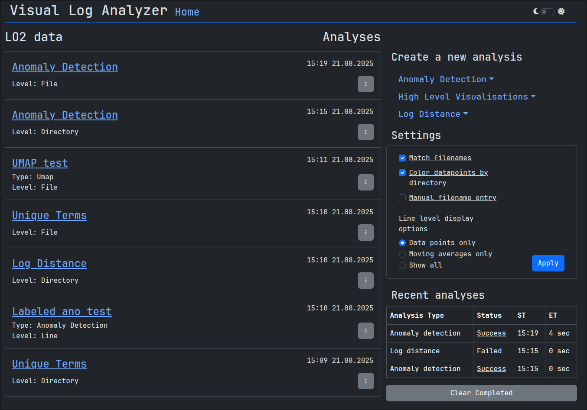

# Visual Log Analyzer

Web application for visualizing and analysing log files.

See the video demonstration on YouTube: [Video](https://www.youtube.com/watch?v=de8QSb3RBGc)



## Feature Overview

Visual Log Analyzer provides similar log analysis capabilities as those found in [LogDelta](https://github.com/EvoTestOps/LogDelta).

Analysis types:

- High-level visualizations
- Log distance analysis
- Anomaly detection

These features can be applied at different levels: directory, file or line, depending on the analysis type.

Analyses are run as background tasks which gives the option to run multiple analyses in parallel. However, performance may vary depending on the size of the datasets and the available memory.

## Run locally

For a more detailed guide, see the [Usage guide](./docs/usage_guide.md).

By default, the program expects the datasets to be located within the `log_data/` directory. To change the location of the log data, update the `LOG_DATA_DIRECTORY` environment variable in the `.env.sample` file. The analysis results are stored in `analysis_results/` as parquet files.

It is a good idea to create the result directory yourself so you don't run into permission issues.

To start the application, clone this repository and run: `docker compose up`

**Note:** Before starting, either:

- Rename `.env.sample` to `.env`
- or run compose with `docker compose --env-file .env.sample up`

You can also modify the default values of the `.env` file according to your needs.

Once running, navigate to [http://localhost:5000/dash/](http://localhost:5000/dash/)

The repo comes with an example light-oauth2 dataset that you can use when trying out the application. Feel free to delete it if you have no use for it.

### Expected log data structure

Example structure:

```
log_data/
├── hadoop
├── lo2_test
│   ├── error-1
│   │   ├── log_file_1.log
│   │   ├── log_file_2.log
│   │   └── log_file_n.log
│   ├── error-2
│   └── unknown-logs
└── lo2_train
    ├── correct-1
    │   └── passing_logs.log
    └── correct-n
```

You can also structure your datasets into subdirectories for easier management, and then specify the base path when creating a project:

```
log_data/
├── hadoop
└── LO2
    ├── lo2_test
    │   └── unknown-logs
    └── lo2_train
        ├── correct_1
        └── correct_n
```

With project base path `./log_data/LO2` when working with the LO2-dataset.

## Usage Tips & Troubleshooting

- **Isolate a specific trace:** Double-clicking a legend item will isolate that trace, hiding all others. This is especially useful in line-level anomaly detection, where plots can be cluttered.

- **Resize plots:** Plots can be resized by dragging the bottom-right corner of the plot.

- **Manual filename entry:** Consider enabling “Manual filename entry” in the settings to avoid dropdown generation delays when working with large datasets with a lot of files, with the drawback of having to manually input filenames.

- **Display moving averages:** To visualize moving averages in line-level plots, make sure to enable them in the settings.

- **“No comparison runs found”-error:** Check “Match filenames”-setting. If it is enabled intentionally, ensure that the log data directory structure is consistent.

- **Timestamps:** If the timestamps are incorrect, try modifying the PostgreSQL time zone setting in the env file.
