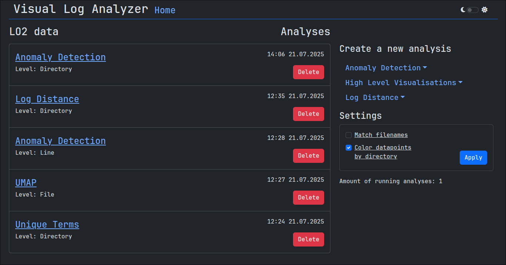

# Visual Log Analyzer

Web application for visualizing and analysing log files.



## Feature Overview 

Visual Log Analyzer provides similar log analysis capabilities as those found in [LogDelta](https://github.com/EvoTestOps/LogDelta). 

Analysis types: 
- High-level visualizations 
- Log distance analysis
- Anomaly detection 

These features can be applied at different levels: directory, file or line, depending on the analysis type. 

Analyses are run as background tasks which gives the option to run multiple analyses in parallel. However, performance may vary depending on the size of the datasets and the available memory. 

## Run locally (development mode)

By default, the program expects the datasets to be located within the `log_data/` directory. To change the location of the log data, update the `LOG_DATA_DIRECTORY` environment variable in the Docker Compose file and adjust the volume mapping accordingly. The analysis results are stored in `analysis_results/` as parquet files.

It is a good idea to create the log data and results directories yourself so you don't run into permission issues.

To start the application clone this repository and run: `docker compose up`

Dash frontend: [http://localhost:5000/dash/](http://localhost:5000/dash/)\
API endpoints: [http://localhost:5000/api/](http://localhost:5000/api/)

### Expected log data structure

Example structure:

```
log_data/
├── hadoop
├── lo2_test
│   ├── error-1
│   │   ├── log_file_1.log
│   │   ├── log_file_2.log
│   │   └── log_file_n.log
│   ├── error-2
│   └── unknown-logs
└── lo2_train
    ├── correct-1
    │   └── passing_logs.log
    └── correct-n
```

## Usage Tips & Troubleshooting 
- **Isolate a specific trace:** Double-clicking a legend item will isolate that trace, hiding all others. This is especially useful in line-level anomaly detection, where plots can be cluttered. 

- **Resize plots:** Plots can be resized by dragging the bottom-right corner of the plot. 

- **Manual filename entry:** Consider enabling “Manual filename entry” in the settings to avoid dropdown generation delays when working with large datasets with a lot of files, with the drawback of having to manually input filenames. 

- **Display moving averages:** To visualize moving averages in line-level plots, make sure to enable them in the settings. 

- **“No comparison runs found”-error:** Check “Match filenames”-setting. If it is enabled intentionally, ensure that the log data directory structure is consistent. 

- **Timestamps:** If the timestamps are incorrect, try modifying the PostgreSQL time zone setting in the `docker-compose.yml` file. 
